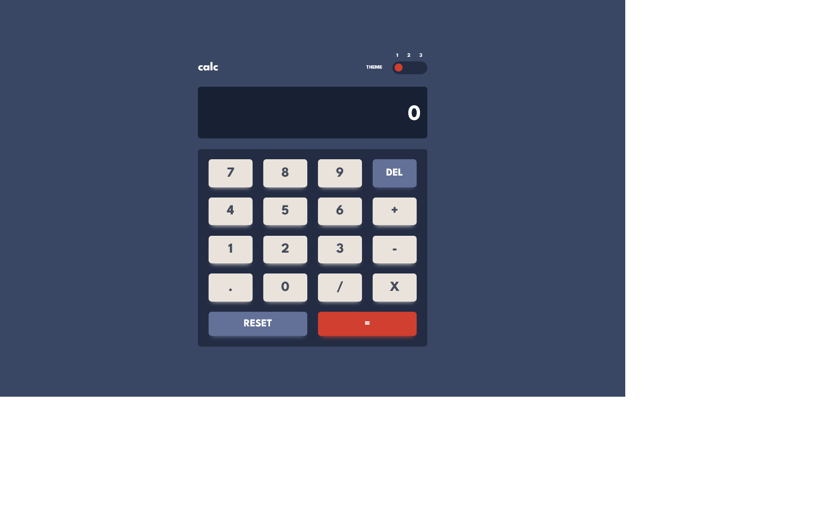
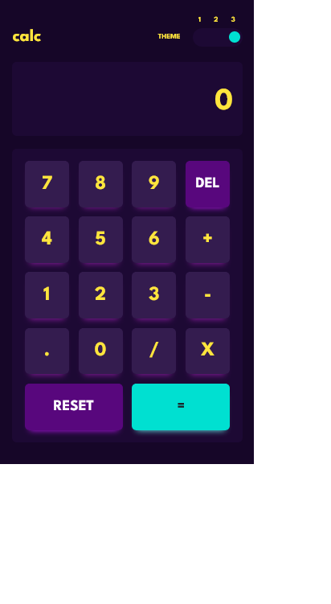

# Frontend Mentor - Calculator app

This is a solution to the Coding bootcamp Calculator App


## Welcome! 👋

## Table of contents

- [Overview](#overview)
  - [Screenshot](#screenshot)
  - [Links](#links)
- [My process](#my-process)
  - [Built with](#built-with)
  - [What I learned](#what-i-learned)
  - [Continued development](#continued-development)
- [Author](#author)
- [Acknowledgments](#acknowledgments)

## Overview

### Screenshot


<!--  -->

### Links

- Solution URL: [Link to my solution git repo](https://github.com/breeMudi/calculator-app_10_20/blob/main/calculator-app-main/main.js)
- Live Site URL: [Link to project view on git-hub live server](https://breemudi.github.io/calculator-app_10_20/blob/main/calculator-app-main/)

## My process

- Create a draft of the web App
- Create a header section, a screen display section, and a keyboard section
- Section Keyboard into rows for easy flex box arrangement on CSS
- Structure the calculator with responsive keys on CSS
- Determine theme adjustment mechanism
- Create default CSS colour variables
- Identify on-hover background colours on fontawesome website


Finally- for JavaScript:

- Create an array to hold the colour hex code for the various themes
- Write functions to access the colour palette according to the user theme
- Access all keys using the addEventListener and querySelectAll methods on the DOM
- Furthermore, using the eval function, evaluate inputted math statements

- I am proud of this Color code arranged in an array as it makes changing colours in the future less cumbersome
```
const theme = {
    one: {bg: ['#3a4764', '#232c43', '#182034'],
    keys: ['#637097', '#404e72', '#d03f2f', '#93261a', '#eae3dc', '#b4a597'],
    text: ['#ffffff', '#444b5a', "#ffffff"],
    hover: ['#ffffff', '#a2b3e1', '#f96c5b']},

    two: {bg: ["#e6e6e6", '#d1cccc', "#ededed"],
    keys: ["#377f86", "#1b5f65", "#ca5502", "#893901", "#e5e4e1", "#a69d91" ],
    text: ["#35352c",,"#35352c", "#ffffff"],
    hover: ['#ffffff', '#62b5bd', '#ff8b38']},

    three: {bg: ["#160628", "#1d0934", "#1d0934"],
    keys: ["#58077d", "#bc15f4", "#00e0d1", "#6cf9f2", "#341c4f", "#871c9c"],
    text: ["#ffe53d", "#ffe53d", "#1b2428"],
    hover: ['#6b34ac', '#8631b0', '#94fff9']}
}
```
- While the colours were applied to root CSS through the setProperty method

### Built with

- Semantic HTML5 markup
- CSS custom properties
- Flexbox
- Mobile-first workflow
- [Styled Components](https://styled-components.com/) - For styles




### What I learned

I utilized the inbuilt javaScript Math.eval function

I also implemented the try-catch clause

It was interesting to figure out how to change the calculator theme

### Continued development

As part of my 20-frontendMentor project challenge series, here is project 10 of 20 ... yaay!

I have now started to learn the Reactjs framework. I can't wait to see how this project would be

carried out differently.


## Author

- Frontend Mentor - [@breeMudi](https://www.frontendmentor.io/profile/breeMudi)
- Twitter - [@Bridgetmudiaga](https://www.twitter.com/Bridgetmudiaga)

## Acknowledgments

Special thanks to Zach Goll (https://github.com/zachgoll/fullstack-roadmap-series) for his wonderful introduction to webdevelopment Bootcamp
